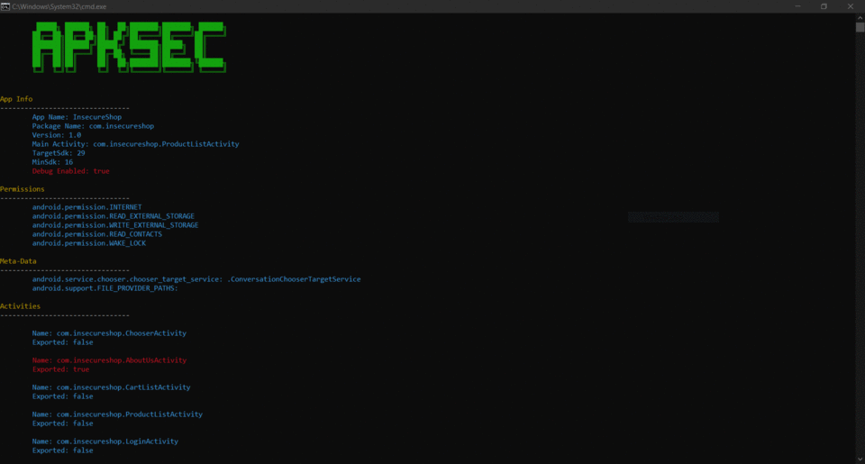

<h1 align="center">APKSEC</h1>

> Tool which gathers basic info from apk, which can be used for Android penetration testing.


## REQUIREMENTS AND INSTALLATION

Build APKSEC:
```
git clone https://github.com/jayateertha043/apksec.git
cd apksec
go build apksec.go
```

or

Install using Go get:

```
go get github.com/jayateertha043/apksec
```

Run apksec:

```
apksec -h
```


## Usage

```
apksec -apk "path to apk"
```

Incase you want to grab results from virustotal:

```
apksec -apk "path to apk" -vt "virustotal_api_key"
```


## Demo




## Todo
- [ ] Extract informations from deep links 
- [ ] Extract common api keys/secrets from strings 

## Author

👤 **Jayateertha G**

* Twitter: [@jayateerthaG](https://twitter.com/jayateerthaG)
* Github: [@jayateertha043](https://github.com/jayateertha043)
